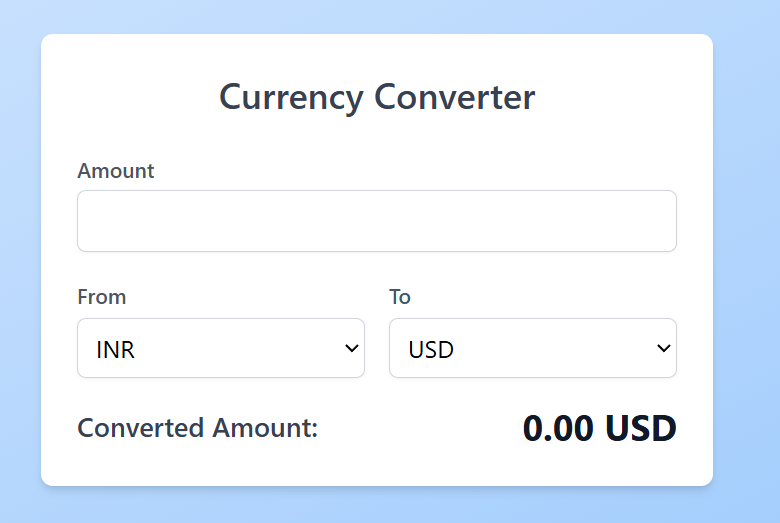

# 💱 Currency Converter App

A simple and responsive currency converter built using **React**. This app allows users to convert between multiple international currencies using real-time exchange rates.

## 📸 Screenshot



## 🚀 Features

- Convert between major currencies (USD, EUR, GBP, INR, JPY, etc.)
- Fetches real-time exchange rates from an external API
- Clean and responsive UI
- Input validation and error handling
- Built with React + modern hooks

## 🛠️ Tech Stack

- React (with Hooks)
- CSS / Tailwind / Bootstrap (your choice)
- Axios for API requests

## 📦 Installation

1. **Clone the repo**
```bash
git clone https://github.com/AnkitKumar666/React-CurrencyConverter.git
cd currency-converter
